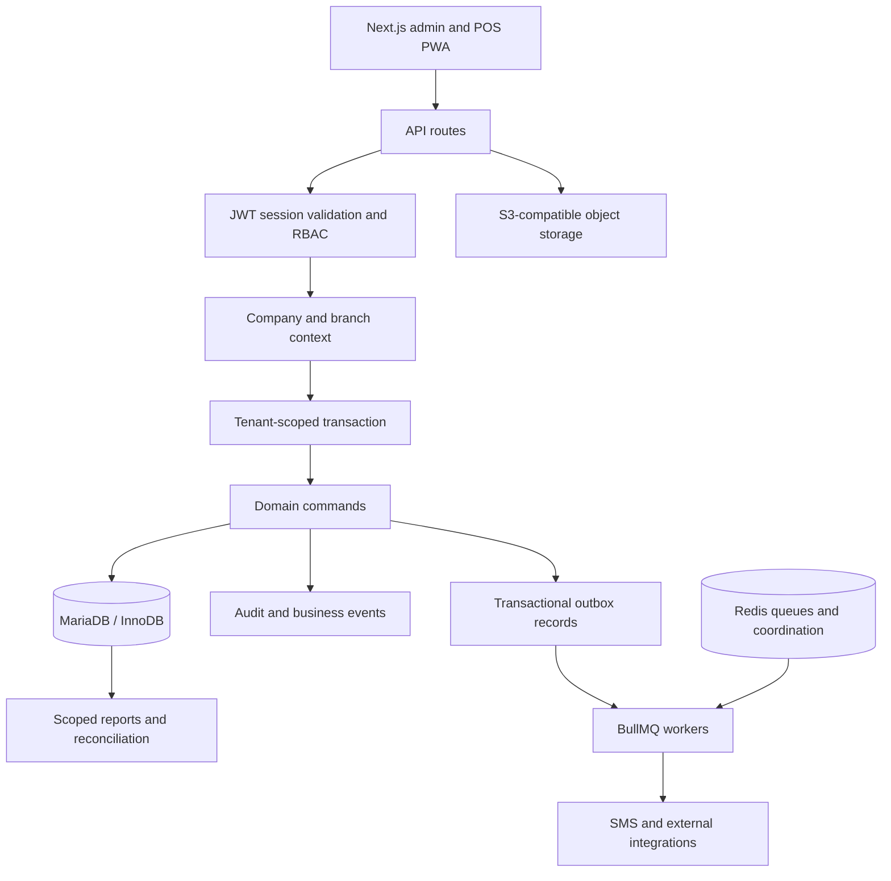

# Gathered ERP/POS project blueprint

Reviewed 2026-10-03 at revision `0808200`. This is an implementation orientation map, not a replacement for the authoritative v4.2 specification. Review scope: repository-wide inventory and static inspection of key architectural paths, module boundaries, documentation, and test setup. No runtime acceptance certification.

## Product and authority

Bangladesh multi-company, multi-branch electronics retail, service, and warranty ERP/POS. Default business timezone/currency: Asia/Dhaka / BDT; persisted timestamps follow UTC semantics. Administrator-led onboarding; optional modules and offline pilot behavior follow blueprint decisions.

Authority: `docs/master-plan/ERP_Pos_Blueprint_v4.2.md`, accepted ADRs, and current source/migrations. Specification and implementation disagreements remain findings. Historical audits are supporting evidence, not proof of current behavior.

## Architecture

The diagram describes the intended primary architecture. Inspect each workflow for actual compliance; not every post-commit activity uses the outbox.

| Layer | Implementation anchors | Review focus |
|---|---|---|
| Web shell | `src/app/layout.tsx`, `src/app/(erp)/dashboard/`, `src/components/` | Theme, navigation, permissions, forms, responsive states |
| API | `src/app/api/v1/` | Methods, input validation, permissions, pagination, error/correlation contracts |
| Identity | `src/lib/auth/`, `src/lib/access/`, `src/lib/permissions/` | Active session family, company status, MFA, role/branch decisions |
| Scoped data | `src/lib/db/index.ts`, `tenantClient.ts`, `modelBranchScope.ts`, `transaction.ts` | Fail-closed predicates, indirect ownership, raw SQL, privileged exceptions |
| Business commands | `src/domain/commands/m2` through `m6`, additional domain folders | Atomic stock/payment/ledger effects, state transitions and snapshots |
| Production schema | `prisma/mariadb/schema.prisma`, `prisma/mariadb/migrations/` | mysql provider, tenant FKs, checks, immutable records, migration parity |
| Reports | `src/reports/`, `src/lib/accounting/`, `src/lib/reconciliation/` | Full ledger totals, reversals, opening balances, stock projections |
| Async delivery | `src/workers/`, `src/lib/queue/`, `src/adapters/`, `src/lib/sms/` | Durable delivery, retry safety, tenant scope and worker heartbeat |
| Offline | `src/components/pwa/`, `src/domain/offline/`, offline API | Device trust, hashes, sequences, conflicts and pilot gating |
| Operations | `scripts/backup/`, `scripts/cpanel-*`, health libraries, runbooks | MariaDB deployment, restore evidence, monitoring and host compatibility |

## Module map

All rows indicate implementation surfaces found, not release acceptance.

| Capability | Main source surfaces | Evidence to gather for acceptance |
|---|---|---|
| Platform, companies, branches, access | Dashboard onboarding/access/settings; auth/access/db libraries | Cross-company/branch denial, onboarding and role changes, session revocation |
| Catalogue, pricing, tax | Products/catalogue APIs and pages; domain invariants/tax | Product activation, barcode/serial uniqueness, effective tax and price snapshots |
| Purchasing and inventory | `commands/m2`, inventory pages, purchase APIs, stockMovement/valuation | Receive/return/transfer/count/landed cost atomicity and stock/GL reconciliation |
| POS, sales, shifts, payments | `commands/m3`, POS/cashier/sales/payment pages | Server pricing, serial transition, COGS/revenue, shift cash, returns/refunds/replay |
| Accounting, expenses, assets, banking | `commands/m4`, accounting libraries and corresponding pages | Balanced immutable journals, currency scale, reversals, close and reconciliation |
| Delivery, service, warranty | `commands/m5`, delivery/service APIs and pages | Authorized lifecycle transitions, stock/service billing and COD settlement |
| CRM, HR, loyalty | `commands/m6`, CRM/HR/gift-card pages | Enablement, payroll posting/payment, conversions and real reward/coupon persistence |
| Receivables and collections | `domain/receivables`, collections and credit-sales pages | Schedules, balances, payment allocation, follow-ups and collection reports |
| SMS and campaigns | `domain/communication`, sms libraries, dueReminders worker | Tenant credentials, audience/policy checks, duplicate-send safety and delivery evidence |
| Integration and governance | Imports/integrations/security/audit/risk/support pages | Import atomicity, webhook scope, privacy/retention/legal holds, risk delivery recovery |
| Reports and print | `src/reports`, `src/app/print`, PDF/ESC-POS libraries | Complete aggregates, scoped export, localized print and actual device output |
| Offline and operations | Offline domain/PWA, workers, health, backup scripts | Conflict replay, deployed worker readiness, disposable restore and measured recovery |

## Representative sale posting

`src/app/api/v1/sales/route.ts` authenticates, checks `sale.post`, validates the request, requires an idempotency key, and runs `postSale` with an idempotency record in the same tenant transaction. `PostSale.ts` prices lines server-side, resolves product/warehouse/serial context, and orchestrates stock, payments and accounting effects. Credit sales require a registered customer and the `credit_sales` flag. POS gift-card/store-credit and combo/batch tenders or items have explicit unavailable paths.

Inspect return, void, payment, inventory and payroll commands independently; this sale path does not prove their atomicity. Risk assessment in the sale API is an asynchronous post-commit hook, which needs separate delivery analysis.

## Test and release blueprint

Observed: 78 unit test files, 34 integration files, 17 browser spec files, plus two k6 load scripts. File counts do not count test cases or passing tests. `vitest.config.ts` uses `tests/setup/disposableDatabase.ts`, requiring loopback mysql on port 43318 with database `readiness_20260912_disposable`.

Acceptance sequence for future authorized validation: establish disposable MariaDB and matching generated Prisma client; run appropriate static/unit/integration checks; verify critical browser workflows and tenant denials; demonstrate migrations, worker/provider delivery, stock/GL reconciliation, safe restore, and load targets. Check current scripts and platform compatibility before executing them.

This checkout has no `node_modules`; no tests, build, browser checks, migrations, provider calls, or restore exercises were run during this review. PITR and achieved recovery targets remain unproven in the current backup runbook.
